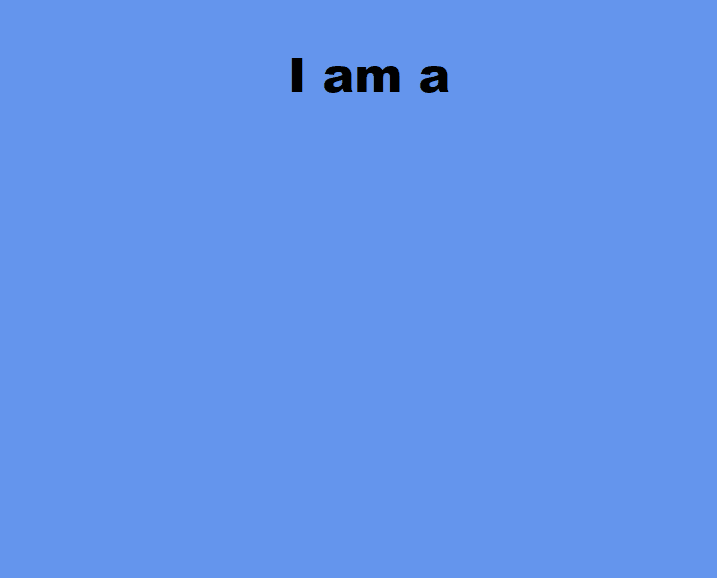

# Text Rotater

### A small library for displaying a group of text in a rotating way.

## Demo:
;

## Example:
index.html
```html
<!DOCTYPE html>
<html lang="en">

<head>
    <meta charset="UTF-8">
    <meta http-equiv="X-UA-Compatible" content="IE=edge">
    <meta name="viewport" content="width=device-width, initial-scale=1.0">
    <title>Document</title>
</head>

<body>
    <style>
        body{
            background-color: cornflowerblue;
            font-weight: 900;
            font-size: 3rem;
            font-family: Arial, Helvetica, sans-serif;
            display: flex;
            justify-content: center;
        }
        p{
            text-align: center;
        }
    </style>
    <p>I am a <br/> <span id="text-rotater" data-rotate="Web developer, Desktop developer, Genius, Writer"></span></p>
    <script src="./text-rotater/index.js"></script>
    <script>
        new TextRotater("text-rotater",{background:"#000",color:"yellow",duration: 2500, direction: "top"}).init();
    </script>
</body>

</html>
```
## Documentation
### installation:
### using npm:
```js
npm i text-rotater
```
or copy the code on [index.js](./index.js)

### linking

using module:
```js
import TextRotater from "text-rotater";
```
<b>or:</b>
```html
<script src="./text-rotater/index.js"></script>
```


After installing/downloading you need to have an html element with an `id` of `text-rotater` then pass to that element a `data-rotate` with multiple words separated by commas as values:
```html
<span id="text-rotater" data-rotate="Web developer, Desktop developer, Genius, Writer"></span>
```
Initialize the function to display words by including the following:
```js
new TextRotater("text-rotater").init();
```

See below on [options](#options)

### <a id="options">options</a>

| Option name | Description | Default
| ------- | ----------- |------------
| background  | changes the background color| initial
| color  | changes the color of the text | initial
| duration  | the duration of the animation in milliseconds | 3000 
| direction  | Whether animation should go up or down, option values are <ul><li>top</li><li>bottom</li></ul>| top

